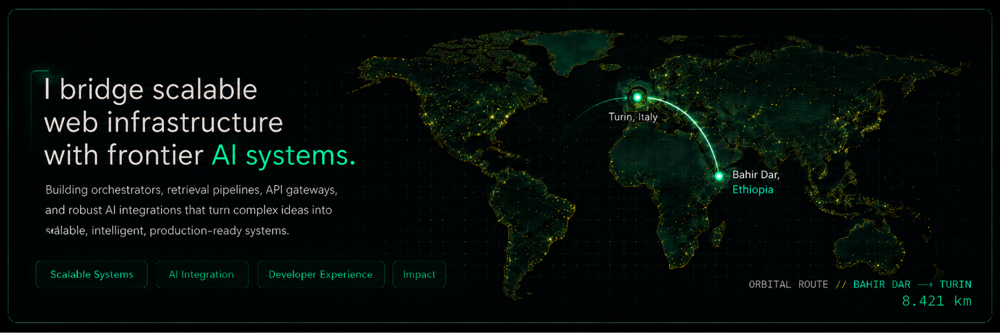

  

 

<table>
  <tr>
    <td width="33%" valign="top">

  

  

 

  
  
  
  
  
  
  
  
  
  
  

</td>
<td width="33%" valign="top">

  

  
  
  
  
  

 

  

  Retrieval pipelines · Embeddings · Semantic search · AI orchestration

</td>
<td width="33%" valign="top">

  

  
  
  
  
  

 

  Retrieval, indexing, embeddings, vector search, reranking, and context-aware generation.

</td>
  </tr>

  <tr>
    <td width="33%" valign="top">

  

  ▹ AI, Deep Learning & Neural Networks 
  ▹ Machine Learning Fundamentals 
  ▹ Advanced LLMs & Transformers 
  ▹ AI Agent Frameworks & MLOps 
  ▹ Systems Design for Scalable AI Applications

</td>
<td width="33%" valign="top">

  

  Aesthetic & fashion photography. 
  Traveling the world. Discovering new places. 
  Meeting people from every culture.

 

  
  
  

  
  
  
  

</td>
<td width="33%" valign="top">

  

  

  

  

</td>
  </tr>
</table>

 

  

  

 

  
<b>More system details</b>

 

<b>Core Tech Stack</b> 
React · TypeScript · JavaScript · Node.js · Express.js · Python · PostgreSQL · SQL · Git · GitHub · Vercel

  

<b>AI Integrations & Frameworks</b> 
OpenAI · Anthropic Claude · LangChain · LlamaIndex · Pinecone · Vector Databases

  

<b>AI Core Competencies</b> 
Retrieval-Augmented Generation · Agentic Workflows · LLM Orchestration · Deep Learning Concepts · Hybrid Search

  

<b>Exploring & Learning</b> 
Artificial Intelligence · Deep Learning & Neural Networks · Machine Learning Fundamentals · Advanced LLMs & Transformers · AI Agent Frameworks & MLOps · Systems Design for Scalable AI Applications

